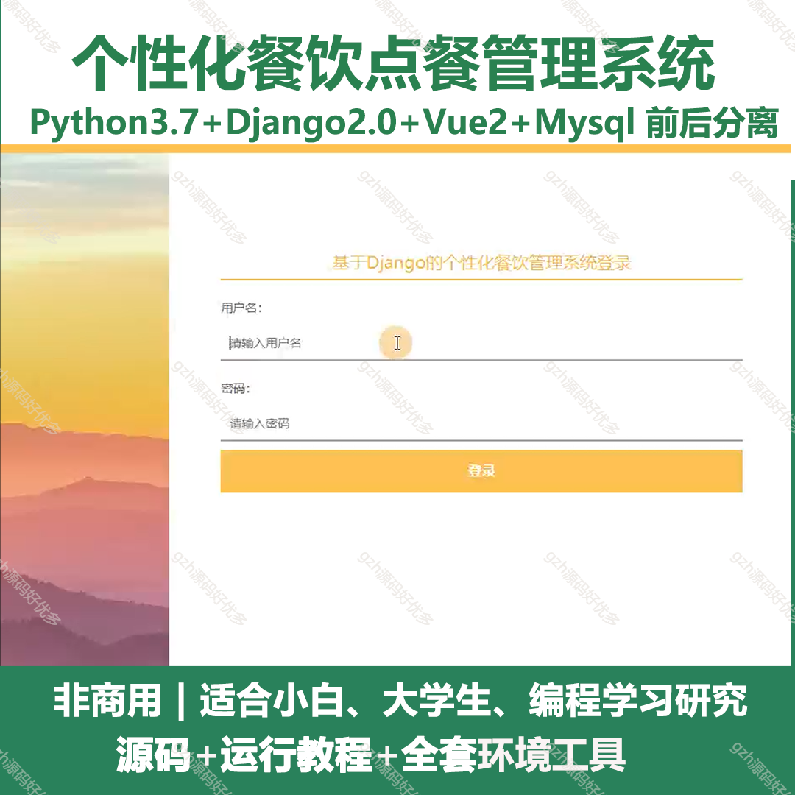
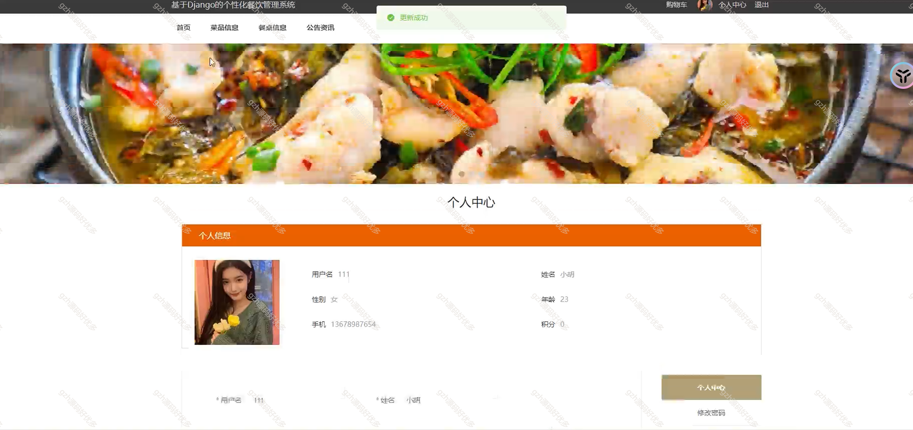
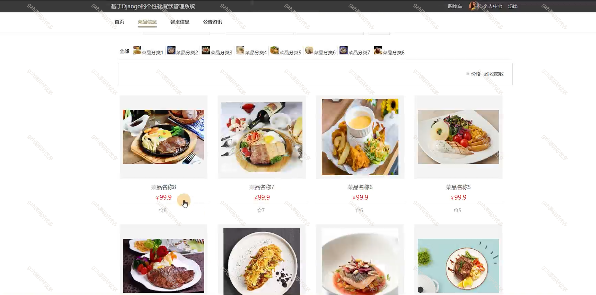
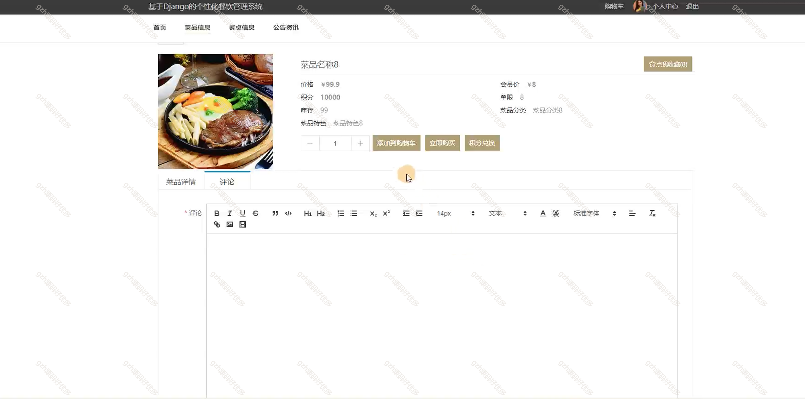
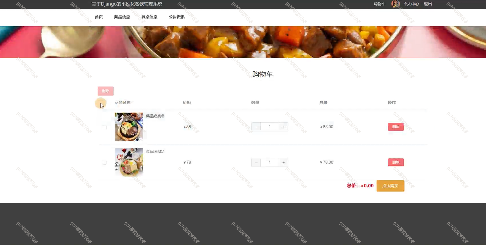
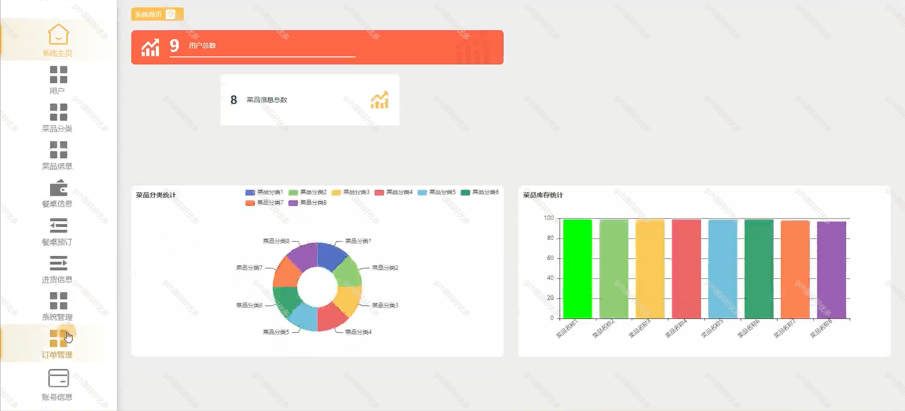
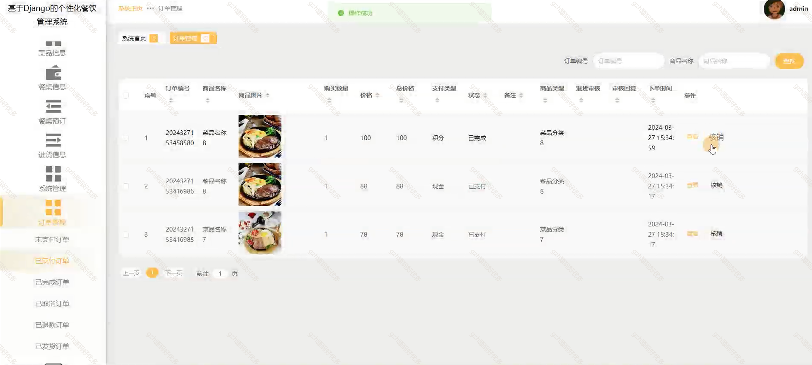
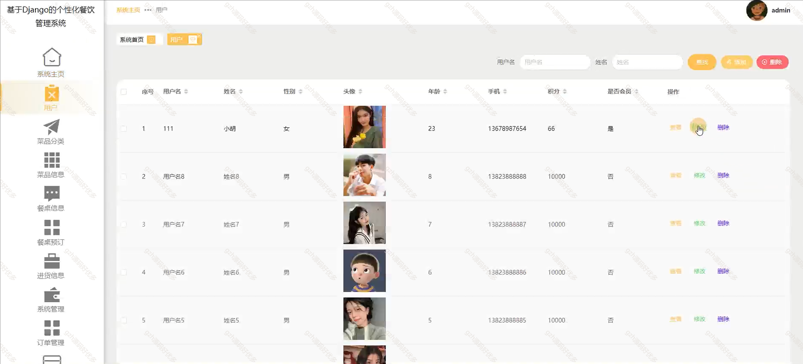
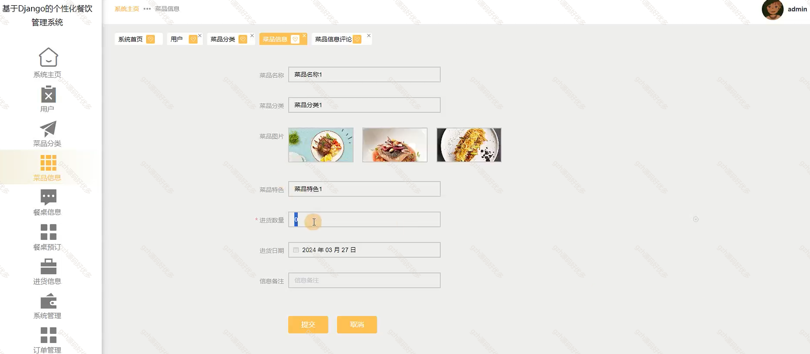
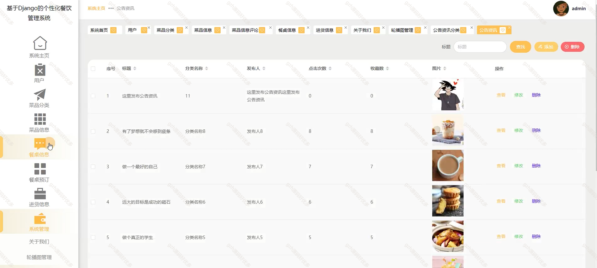

# python012
python012基于Django的个性化餐饮点餐管理系统
 
## 查看主页获取源码

### 一、关键词

餐厅点餐、个性化推荐美食、餐饮、美食

 

### 二、作品包含

源码+数据库+全套环境和工具资源+部署教程

 

### 三、项目技术

前端技术：Html、Css、Js、Vue2.0、Element-ui
后端技术：Python3.7、Django2.0

  

 

### 四、运行环境（以下版本亲测，其他版本未知，请自测）

开发工具：PyCharm + VSCODE

数据库：MySQL5.7（最低要5.7版本）

数据库管理工具：Navicat10+

Python：Python3.7

前端Nodejs：14

浏览器：谷歌浏览器

 

### 五、项目介绍

项目编号：python012

个性化餐饮点餐管理系统可实现餐厅菜品展示、个性化点餐（含定制化需求 ），支持后台对菜品、订单、用户等信息统筹管控，助力餐饮服务高效、精准适配食客需求 。

该基于 Django 的个性化餐饮管理系统，具备系统主页、用户、菜品分类及信息、餐桌信息及预订、进货信息管理和系统管理等功能，覆盖餐饮运营多环节 

 

### 六、运行截图

